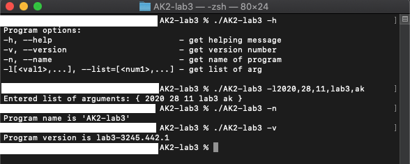

# AK-lab3

#### Program command:

* -h, --help                            -> get helping message
*	-v, --version                   		  -> get version number
*	-n, --name                       		  -> get name of program
*	-l[arg1,...], --list=[arg1,...]       -> get list of arg

#### Screenshot:

